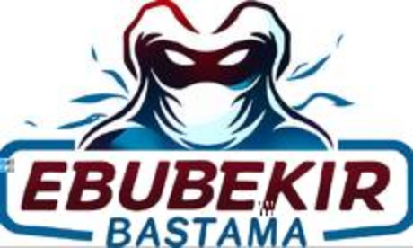
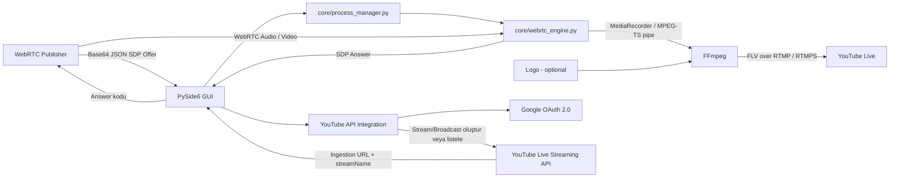

# EBS WebRTC → YouTube Live




> WebRTC üzerinden alınan ses ve görüntüyü `aiortc` ile karşılayan, medya akışını FFmpeg üzerinden YouTube Live RTMP/RTMPS hedefine aktaran Python tabanlı masaüstü bridge uygulaması.

## 📌 Proje Hakkında

EBS WebRTC → YouTube Live, WebRTC tarafında **izleyici/receiver** rolü üstlenen ve alınan medya track'lerini YouTube canlı yayın girişine yönlendiren bir uygulamadır.

Repository'deki güncel modüler uygulama `app.py` ile başlar. PySide6 arayüzü üzerinden WebRTC offer kodu alınır, `aiortc` ile SDP answer üretilir ve answer kodu yayıncıya geri gönderilir. Bağlantı kurulduğunda ses/görüntü `MediaRecorder` aracılığıyla MPEG-TS olarak FFmpeg'in standart girdisine aktarılır; FFmpeg çıkışı FLV kapsayıcısı ile RTMP/RTMPS hedefine gönderir.

Uygulama iki YouTube çıkış yöntemi sunar:

- **Manuel RTMP:** RTMP/RTMPS adresi ve stream key kullanıcı tarafından girilir.
- **YouTube API:** Google OAuth ile YouTube hesabına bağlanılır; mevcut Live Stream kaynakları listelenebilir veya yeni broadcast + stream oluşturulup bind edilerek ingestion adresi otomatik alınabilir.

Repository ayrıca önceki/alternatif arayüz olan `gui.py` ile bağımsız headless motor olan `src/webrtc_to_youtube.py` dosyasını da içerir. Güncel modüler masaüstü akışının giriş noktası `app.py`'dir.

## ✨ Özellikler

- Base64 kodlanmış JSON içindeki SDP offer/answer verileriyle manuel WebRTC signaling akışı
- `aiortc` tabanlı `RTCPeerConnection`
- Google ve Twilio STUN sunucuları üzerinden ICE candidate toplama
- Video ve ses track'lerini MPEG-TS pipe üzerinden FFmpeg'e aktarma
- Manuel RTMP/RTMPS hedefi
- `.env` içindeki `YOUTUBE_RTMP` değişkenini destekleyen headless motor
- YouTube OAuth 2.0 yetkilendirmesi
- Mevcut YouTube Live Stream kaynaklarını listeleme ve ingestion URL'sini alma
- YouTube Live Streaming API ile yeni broadcast ve stream oluşturma ve bind etme
- `private`, `unlisted` ve `public` yayın gizlilik seçenekleri
- 1920×1080, 1280×720 ve 854×480 çözünürlük seçenekleri
- 30 veya 60 FPS seçimi modüler GUI'de
- H.264 (`libx264`) yeniden kodlama seçeneği
- AAC 128 kbps, 44.1 kHz, stereo ses çıkışı yeniden kodlama modunda
- Yapılandırılabilir video bitrate, maxrate ve VBV buffer
- PNG/JPG/JPEG/WebP logo seçimi modüler GUI'de
- Logo genişliği, opacity ve dört köşe konumlandırması
- Logo kullanıldığında FFmpeg filter graph üzerinden otomatik video yeniden kodlama
- FFmpeg yürütülebilir dosyasını GUI'den seçme
- Windows'ta `winget` üzerinden `Gyan.FFmpeg` kurulumunu deneme
- Ayarları `config/settings.json` dosyasında saklama
- YouTube OAuth token'ını `config/youtube_token.json` dosyasında saklama
- Canlı işlem loglarını ve üretilen answer kodunu arayüzde gösterme

## 🧰 Teknoloji Kartları

| Teknoloji | Kullanım |
|---|---|
| 🐍 **Python** | Uygulama, WebRTC motoru ve YouTube entegrasyonu |
| 🖥️ **PySide6 / Qt** | Masaüstü kullanıcı arayüzü ve `QProcess` tabanlı process yönetimi |
| 📡 **aiortc** | WebRTC peer connection, SDP answer ve medya track'leri |
| 🎞️ **PyAV / av** | `aiortc` medya altyapısının bağımlılığı |
| ⚙️ **FFmpeg** | RTMP/RTMPS çıkışı, H.264/AAC encode ve logo overlay |
| ▶️ **YouTube Data API v3 / Live Streaming API** | Kanal, live stream ve live broadcast işlemleri |
| 🔐 **Google OAuth 2.0** | YouTube hesabı yetkilendirmesi ve token yenileme |
| 🌐 **STUN** | ICE adaylarının toplanması için Google ve Twilio STUN sunucuları |
| 🔧 **python-dotenv** | Headless motorda `.env` üzerinden `YOUTUBE_RTMP` okuma |

## 🏗️ Mimari



### Medya pipeline'ı

```text
WebRTC Publisher
      │
      │ SDP Offer / Answer
      ▼
aiortc RTCPeerConnection
      │
      │ audio + video tracks
      ▼
aiortc MediaRecorder
      │
      │ MPEG-TS → pipe:0
      ▼
FFmpeg
      │
      ├─ copy mode veya H.264/AAC re-encode
      ├─ optional logo overlay
      │
      ▼
FLV / RTMP(S)
      │
      ▼
YouTube Live
```

## 📋 Gereksinimler

- **Python 3.10+**
- `pip`
- **FFmpeg**
- WebRTC yayıncısından alınmış uyumlu Base64/JSON SDP offer kodu
- YouTube'a yayın yapılacaksa geçerli RTMP/RTMPS ingestion adresi ve stream key
- YouTube API modu kullanılacaksa Google Cloud üzerinde **Desktop app** türünde OAuth istemcisi ve YouTube API erişimi

Python bağımlılıkları `requirements.txt` içinde tanımlıdır:

```text
aiortc>=1.9.0
av>=12.0.0
python-dotenv>=1.0.1
PySide6>=6.7.0
google-api-python-client>=2.137.0
google-auth>=2.32.0
google-auth-oauthlib>=1.2.1
google-auth-httplib2>=0.2.0
```

## 🚀 Kurulum

Repository'yi klonlayın:

```bash
git clone https://github.com/ebubekirbastama/ebs-webrtc-to-youtube.git
cd ebs-webrtc-to-youtube
```

İsteğe bağlı sanal ortam oluşturun:

```bash
python -m venv .venv
```

Windows:

```bat
.venv\Scripts\activate
python -m pip install -r requirements.txt
```

Linux/macOS:

```bash
source .venv/bin/activate
python -m pip install -r requirements.txt
```

> `app.py` başlangıçta `requirements.txt` içindeki eksik Python paketlerini kontrol eder ve eksik olanları `pip` ile kurmayı dener. Manuel kurulum, ortamı önceden hazırlamak ve kurulumu daha kontrollü yapmak için kullanılabilir.

### FFmpeg

FFmpeg sistem `PATH` değişkeninde bulunabilir veya GUI üzerinden doğrudan yürütülebilir dosya yolu seçilebilir.

Windows'ta modüler arayüzdeki **FFMPEG OTOMATİK KUR** düğmesi, `winget` mevcutsa şu paketi kurmayı dener:

```text
Gyan.FFmpeg
```

Kod ayrıca Windows'ta aşağıdaki konumları kontrol eder:

```text
./ffmpeg.exe
./bin/ffmpeg.exe
C:\ffmpeg.exe
C:\ffmpeg\bin\ffmpeg.exe
```

## ⚙️ Yapılandırma

### Uygulama ayarları

Örnek ayarlar [`config/settings.json.example`](./config/settings.json.example) dosyasındadır:

```json
{
  "ffmpeg_path": "",
  "resolution": "1920x1080",
  "fps": 30,
  "bitrate": "5500k",
  "maxrate": "6500k",
  "bufsize": "12000k",
  "logo_width": 220,
  "logo_opacity": 0.9,
  "logo_position": "top-right",
  "reencode": true
}
```

Modüler GUI ayarları `config/settings.json` dosyasına kaydeder. Kodun dahili varsayılanlarında ayrıca `rtmp_manual` alanı bulunur.

### Environment variable

Headless WebRTC motorları `YOUTUBE_RTMP` değişkenini destekler:

```env
YOUTUBE_RTMP=rtmps://YOUR_INGESTION_ADDRESS/YOUR_STREAM_KEY
```

Gerçek stream key değerini repository'ye commit etmeyin.

### Google OAuth

YouTube API modu için [`client_secret.example.json`](./client_secret.example.json) biçimine uygun gerçek OAuth istemci dosyasını proje köküne aşağıdaki adla yerleştirin:

```text
client_secret.json
```

Yetkilendirme tamamlandığında token şu dosyaya yazılır:

```text
config/youtube_token.json
```

Kullanılan OAuth scope:

```text
https://www.googleapis.com/auth/youtube.force-ssl
```

## ▶️ Kullanım

### Önerilen: modüler masaüstü uygulaması

Windows'ta:

```bat
start_windows.bat
```

veya doğrudan:

```bash
python app.py
```

`start_windows.bat`, önce `py -3 app.py` komutunu dener; hata oluşursa `python app.py` ile tekrar çalıştırır.

Arayüzde temel akış:

1. WebRTC yayıncısından oluşturulan **Offer / davet kodunu** ilgili alana yapıştırın.
2. Manuel RTMP kullanıyorsanız RTMP/RTMPS adresini girin; YouTube API kullanıyorsanız hesabı bağlayıp mevcut stream'i seçin veya yeni yayın oluşturun.
3. FFmpeg yolunun doğru olduğundan emin olun.
4. Çözünürlük, FPS, bitrate ve logo ayarlarını yapılandırın.
5. **BAĞLANTIYI BAŞLAT** düğmesine basın.
6. Üretilen **Answer** kodunu kopyalayıp WebRTC yayıncısına geri gönderin.
7. Peer connection kurulduğunda medya FFmpeg üzerinden YouTube hedefine aktarılır.

### YouTube API ile yeni yayın oluşturma

Arayüzde **YENİ YOUTUBE YAYINI OLUŞTUR** işlemi:

1. Bir `liveBroadcast` oluşturur.
2. Seçili çözünürlük ve FPS'e göre bir `liveStream` oluşturur.
3. Broadcast ile stream'i bind eder.
4. YouTube tarafından dönen ingestion adresi ile `streamName` değerini birleştirerek RTMP/RTMPS URL'sini arayüze yerleştirir.

Yeni yayın için başlangıç zamanı kod tarafından yaklaşık **2 dakika sonrası** olarak ayarlanır. Varsayılan API parametreleri `low` latency, `autoStart=true`, `autoStop=true` ve reusable stream şeklindedir.

### Headless motor

Repository'deki bağımsız motor:

```bash
python src/webrtc_to_youtube.py --rtmp "rtmps://INGESTION_ADDRESS/STREAM_KEY" --ffmpeg "/path/to/ffmpeg"
```

RTMP adresi `.env` üzerinden verilirse:

```bash
python src/webrtc_to_youtube.py --ffmpeg "/path/to/ffmpeg"
```

Desteklenen CLI seçenekleri:

| Parametre | Açıklama | Varsayılan |
|---|---|---|
| `--rtmp` | RTMP/RTMPS hedefi | `YOUTUBE_RTMP` |
| `--ffmpeg` | FFmpeg executable yolu | `C:\ffmpeg.exe` |
| `--reencode` | H.264/AAC yeniden kodlamayı zorlar | kapalı |
| `--logo` | Logo görseli | yok |
| `--logo-width` | Logo genişliği | `200` |
| `--logo-opacity` | Logo opacity | `1.0` |
| `--logo-position` | `top-left`, `top-right`, `bottom-left`, `bottom-right` | `top-left` |
| `--logo-margin-x` | Yatay kenar boşluğu | `50` |
| `--logo-margin-y` | Dikey kenar boşluğu | `50` |
| `--resolution` | Çıkış çözünürlüğü | `1920x1080` |
| `--bitrate` | Video bitrate | `5500k` |
| `--maxrate` | Maksimum video bitrate | `6500k` |
| `--bufsize` | VBV buffer | `12000k` |
| `--fps` | Hedef FPS / GOP hesabı | `30` |

> `core/webrtc_engine.py` de aynı temel bridge mantığını kullanır ancak modüler GUI tarafından `QProcess` üzerinden çağrılmak üzere tasarlanmıştır ve `--ffmpeg` parametresini zorunlu tutar.

## 🎥 / 🖼️ Görseller

Repository'de iki logo asset'i bulunmaktadır:

- [`logo.png`](./logo.png) — modüler GUI'nin varsayılan yayın watermark dosyası
- [`assets/logo.svg`](./assets/logo.svg) — `gui.py` arayüzünün uygulama logosu ve varsayılan logo kaynağı

`gui.py`, SVG logoyu yayın overlay'i için gerektiğinde geçici PNG dosyasına dönüştürür.

## 📁 Proje Yapısı

```text
ebs-webrtc-to-youtube/
├── LICENSE
├── README.md
├── app.py
├── bootstrap.py
├── gui.py
├── start_windows.bat
├── requirements.txt
├── client_secret.example.json
├── logo.png
├── assets/
│   ├── README.md
│   └── logo.svg
├── config/
│   └── settings.json.example
├── core/
│   ├── __init__.py
│   ├── process_manager.py
│   ├── settings.py
│   └── webrtc_engine.py
├── src/
│   └── webrtc_to_youtube.py
├── ui/
│   ├── __init__.py
│   ├── main_window.py
│   ├── styles.py
│   └── widgets.py
├── youtube/
│   ├── __init__.py
│   ├── api.py
│   └── auth.py
└── logs/
    └── log.txt
```

Python tarafından üretilmiş `__pycache__/` dizinleri de mevcut repository geçmişinde bulunabilir; bunlar uygulamanın kaynak mimarisinin parçası değildir.

## 🔄 Çalışma Akışı

1. Kullanıcı WebRTC yayıncısından Base64 kodlanmış offer alır.
2. Uygulama offer içindeki JSON ve SDP verisini çözer.
3. `RTCPeerConnection`, offer'ı remote description olarak kabul eder.
4. FFmpeg process'i MPEG-TS stdin bekleyecek şekilde başlatılır.
5. `aiortc` SDP answer üretir ve ICE gathering'in tamamlanmasını en fazla yaklaşık 8 saniye bekler.
6. Answer tekrar Base64/JSON biçiminde kodlanır ve yayıncıya iletilir.
7. WebRTC audio/video track'leri alındığında `MediaRecorder` üzerinden FFmpeg stdin'ine MPEG-TS gönderilir.
8. FFmpeg, seçime göre stream copy veya H.264/AAC re-encode uygular.
9. Logo verilmişse video ölçeklenir/pad edilir ve FFmpeg overlay filtresi uygulanır.
10. Son çıktı FLV kapsayıcısı ile RTMP/RTMPS hedefine gönderilir.

## 🧪 Sorun Giderme

### FFmpeg bulunamıyor

Modüler GUI'de FFmpeg yolunu manuel seçin. Windows kullanıyorsanız **FFMPEG OTOMATİK KUR** seçeneği `winget` üzerinden `Gyan.FFmpeg` kurulumunu deneyebilir.

### `client_secret.json bulunamadı`

YouTube API modu için Google Cloud'dan alınan Desktop App OAuth dosyasını proje köküne `client_secret.json` adıyla koyun. Repository'deki `client_secret.example.json` yalnızca şablondur.

### WebRTC bağlantısı kurulmuyor

Offer kodunun uygulamanın beklediği `base64(JSON({"sdp": {...}}))` yapısında olduğundan emin olun. Kod yalnızca STUN sunucuları tanımlar; TURN yapılandırması bulunmaz. Kısıtlayıcı NAT/firewall ortamlarında peer-to-peer bağlantı kurulamayabilir.

### ICE toplama zaman aşımı

ICE gathering yaklaşık 8 saniye içinde tamamlanmazsa motor mevcut adaylarla devam eder. Bağlantının çalışması mevcut ICE adaylarının iki peer arasında ulaşılabilir olmasına bağlıdır.

### YouTube yayın başlamıyor

RTMP/RTMPS ingestion adresinin stream key ile birlikte eksiksiz olduğundan emin olun. Yeniden kodlama kapalıyken giriş codec/profilinin YouTube tarafında kabul edilmemesi halinde `--reencode` veya GUI'deki **H.264 yeniden encode** seçeneğini kullanın.

### Logo bulunamıyor

Logo yolu gerçek bir dosyaya işaret etmelidir. Modüler GUI PNG, JPG, JPEG ve WebP seçimine izin verir. Logo aktif olduğunda FFmpeg video filtresi nedeniyle video yeniden kodlanır.

### Python paketi kurulumu hata veriyor

Bağımlılıkları manuel olarak kurmayı deneyin:

```bash
python -m pip install --upgrade pip
python -m pip install -r requirements.txt
```

## ⚠️ Teknik Sınırlamalar

- Signaling sunucusu yoktur; offer ve answer kodları kullanıcı tarafından manuel taşınır.
- ICE yapılandırmasında STUN sunucuları vardır ancak TURN sunucusu desteği yapılandırılmamıştır.
- Otomatik reconnect/backoff döngüsü bulunmaz; WebRTC bağlantısı `failed`, `closed` veya `disconnected` olduğunda mevcut bridge oturumu sonlanır.
- Logo kullanımı video filter graph gerektirdiği için H.264 yeniden kodlamayı zorunlu hale getirir ve CPU kullanımını artırabilir.
- `reencode` kapalı ve logo yokken FFmpeg `-c copy` kullanır; kaynak codec/profil YouTube ile uyumsuzsa yayın kabul edilmeyebilir.
- Headless `src/webrtc_to_youtube.py` için varsayılan FFmpeg yolu Windows odaklı `C:\ffmpeg.exe` değeridir.
- Windows dışındaki sistemlerde otomatik FFmpeg kurulum mekanizması yoktur.
- Repository içinde otomatik test suite'i bulunmamaktadır.
- Repository'nin güncel `main` dalında `.gitignore` dosyası bulunmamaktadır; hassas ve çalışma zamanı dosyalarının yanlışlıkla commit edilmemesi kullanıcı sorumluluğundadır.
- Repository'de hem eski `gui.py` / `src/` akışı hem de yeni modüler `app.py` / `core/` / `ui/` akışı birlikte bulunmaktadır; davranış ve varsayılan değerlerde küçük farklılıklar vardır.

## 🔐 Güvenlik

Aşağıdaki dosya ve değerleri **public repository'ye göndermeyin**:

```text
client_secret.json
config/youtube_token.json
config/settings.json   # manuel RTMP URL'si stream key içerebilir
.env
```

Özellikle:

- `client_secret.json` Google OAuth istemci secret'ını içerir.
- `config/youtube_token.json` OAuth access/refresh token bilgileri içerebilir.
- Manuel RTMP adresi genellikle stream key içerdiğinden `config/settings.json` hassas olabilir.
- `YOUTUBE_RTMP` değerini gerçek stream key ile birlikte kaynak koda veya README'ye yazmayın.
- Uygulama RTMP alanını GUI'de parola modunda gösterse de değer uygulama belleğinde ve manuel modda ayar dosyasında bulunabilir.
- `core/settings.py`, `stream_key` adlı doğrudan bir alanı kaydetmeden önce kaldırır; ancak `rtmp_manual` alanının içinde bulunan key ayrıca ayrıştırılıp maskelenmez.
- FFmpeg ve logo yolları yerel dosya sisteminden kullanıcı tarafından seçilir; yalnızca güvendiğiniz dosyaları ve FFmpeg binary'lerini kullanın.

## 🛠️ Geliştirme / Modernizasyon

Kaynak kodunun mevcut durumuna göre geliştirilebilecek başlıca alanlar:

- Manuel offer/answer değişimini azaltmak için ayrı bir signaling katmanı
- TURN sunucusu yapılandırması
- Reconnect ve kontrollü retry/backoff mekanizması
- `gui.py` ile modüler `app.py` akışlarının tek uygulama mimarisinde birleştirilmesi
- Platform bağımsız FFmpeg keşfi/kurulum deneyiminin genişletilmesi
- Secret ve runtime dosyaları için repository seviyesinde ignore politikası
- Otomatik unit/integration testleri
- Ayar doğrulama ve RTMP secret saklama modelinin güçlendirilmesi

Bu maddeler mevcut kodda uygulanmış özellikler değil, repository'de görülen teknik borç ve geliştirme alanlarıdır.

## 📄 Lisans

Bu proje **Apache License 2.0** altında lisanslanmıştır.

Lisans metni için [`LICENSE`](./LICENSE) dosyasına bakabilirsiniz.

## 👤 Geliştirici

**Ebubekir Bastama**

- GitHub: [@ebubekirbastama](https://github.com/ebubekirbastama)
- Repository: [ebubekirbastama/ebs-webrtc-to-youtube](https://github.com/ebubekirbastama/ebs-webrtc-to-youtube)
